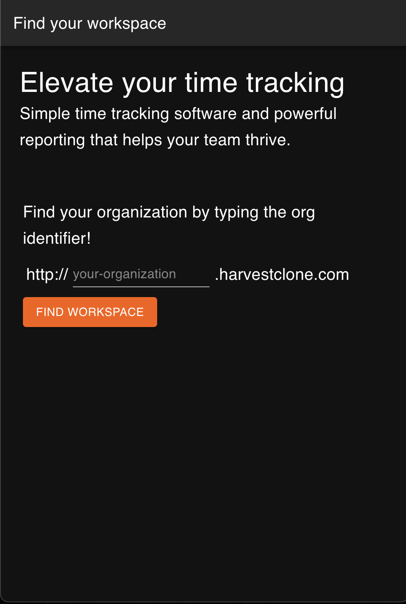

# HarvestTime KMM 

Multi-Platform Harvest Time Tracking clone project built with SwiftUI, Jetpack Compose, Compose for Wear OS,. Currently running on

* Desktop JVM (Jetpack Compose) 🚧  WIP
* Android (Jetpack Compose) 🚧  WIP
* iOS (SwiftUI) 🚧  WIP
* macOS (SwiftUI) 🚧  WIP
* Web (ReactJS) 🚧  WIP
* Android App Widget ⚠️ TODO 
* Wear OS (Compose for Wear OS) ⚠ TODO
* iOS App Widget (SwiftUI) ⚠️ TODO
* watchOS (SwiftUI) ⚠️ TODO

Build using [PraxisKMP](https://github.com/mutualmobile/PraxisKMP) as the base project. 

### API

The Harvest API written in SpringBoot is WIP. Find the repo from [here](https://github.com/mutualmobile/HarvestAPISpring).
- Find Organization ✅ DONE
- Sign In User  ✅ DONE
- Sign Up User  ✅ DONE
- Forgot Password 🚧 WIP
- Change Password 🚧 WIP

### TODOs

1. Koin does not allow to return dependencies with await() which affects providing SqlDriver on JSPlatform. 
   Figure out a way for proper DI for SQlDriver.
   see issue here: https://github.com/InsertKoinIO/koin/issues/388

### Screenshots

* Android (Jetpack Compose)

* iOS (SwiftUI)

* Web (ReactJS)

* Compose Desktop (Compose for Desktop)

* Android Wear OS (Compose for Wear OS)

* watchOS (SwiftUI)

* macOS (SwiftUI)

### Languages, libraries and tools used

* [Kotlin](https://kotlinlang.org/)
* [Kotlin Coroutines](https://kotlinlang.org/docs/reference/coroutines-overview.html)
* [Kotlinx Serialization](https://github.com/Kotlin/kotlinx.serialization)
* [Ktor client library](https://github.com/ktorio/ktor)
* [Android Architecture Components](https://developer.android.com/topic/libraries/architecture/index.html)
* [Koin](https://github.com/InsertKoinIO/koin)
* [SQLDelight](https://github.com/cashapp/sqldelight)
* [Jetpack Compose](https://developer.android.com/jetpack/compose)
* [SwiftUI](https://developer.apple.com/documentation/swiftui)
* [KMP-NativeCoroutines](https://github.com/rickclephas/KMP-NativeCoroutines)