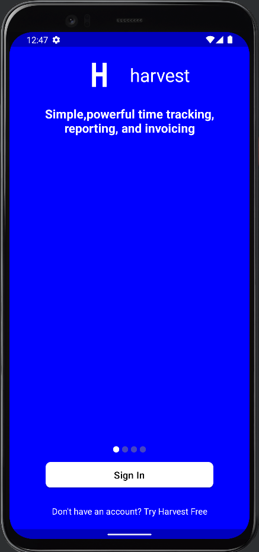
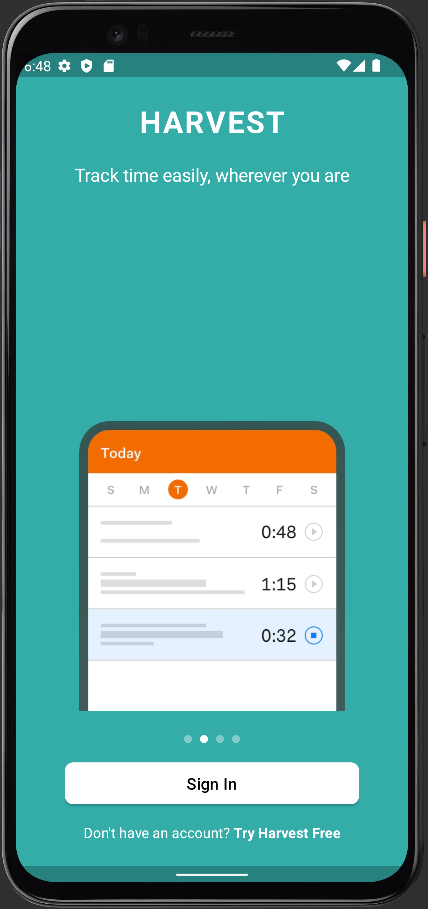
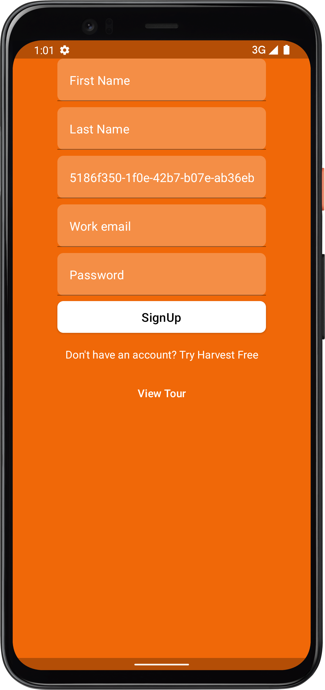
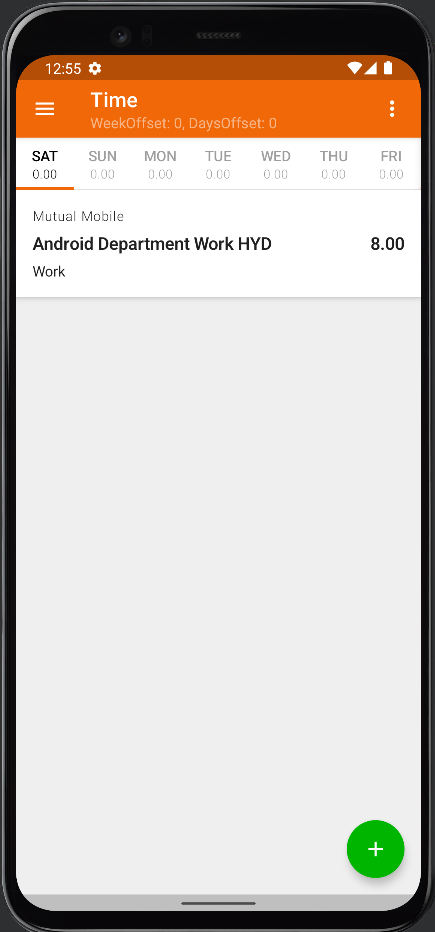
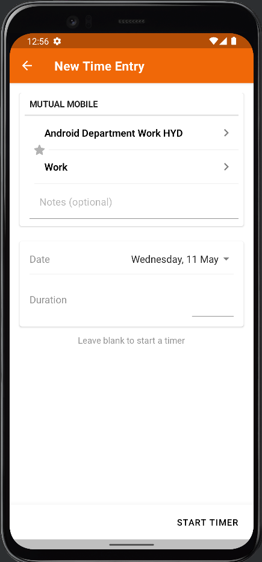
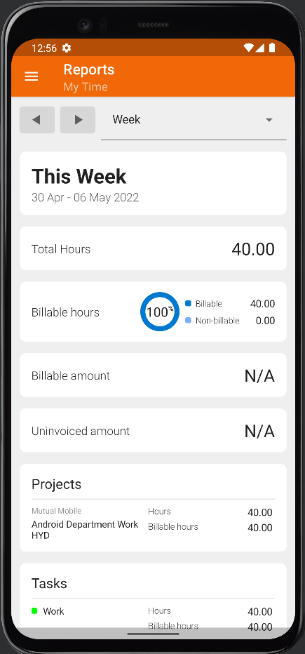
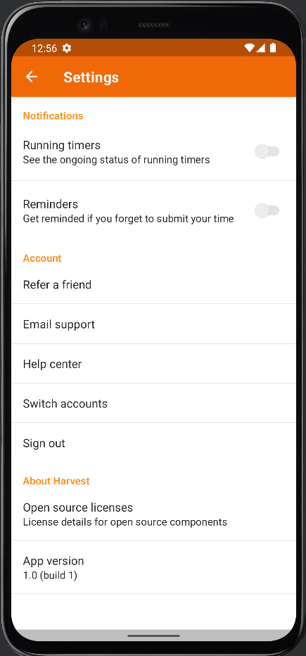
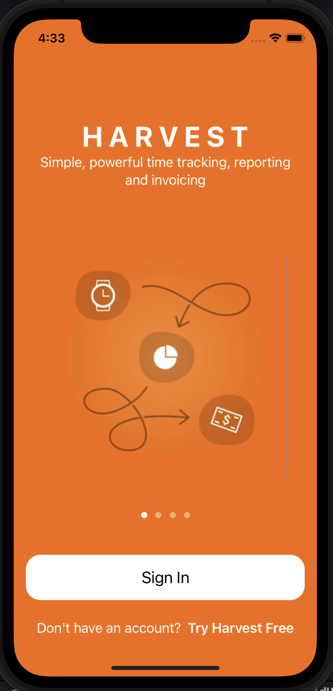
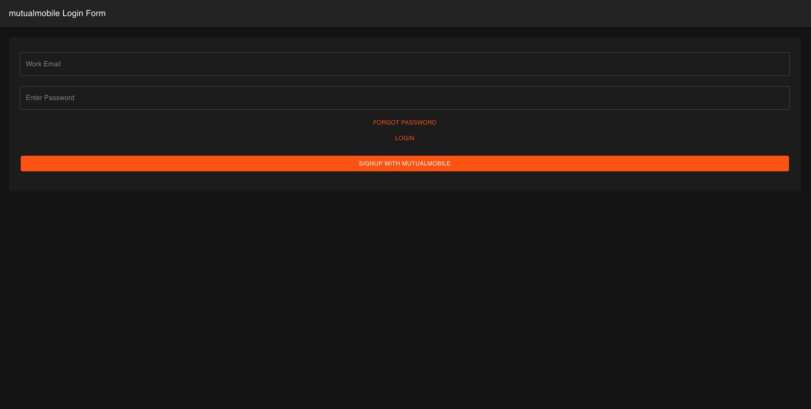

# HarvestTime KMM 

Multi-Platform Harvest Time Tracking clone project built with SwiftUI, Jetpack Compose, Kotlin-ReactJs Currently running on

* Desktop JVM (Jetpack Compose) 🚧  WIP
* Android (Jetpack Compose) 🚧  WIP
* iOS (SwiftUI) 🚧  WIP
* macOS (SwiftUI) 🚧  WIP
* Web (ReactJS) 🚧  WIP

Build using [PraxisKMP](https://github.com/mutualmobile/PraxisKMP) as the base project. 

### API

The Harvest API written in SpringBoot is WIP. Find the repo from [here](https://github.com/mutualmobile/HarvestAPISpring).
- Find Organization ✅ DONE
- Sign In User  ✅ DONE
- Sign Up User  ✅ DONE
- Login User ✅ DONE
- Forgot Password 🚧 WIP
- Change Password 🚧 WIP
- 
## 🏗️️ Built with ❤️ using Kotlin

| What            | How                        |
|----------------	|------------------------------	|
| 🎭 Android UI   | [Jetpack Compose](https://developer.android.com/jetpack/compose)                |
| 🎭 IOS UI   | [Swift UI](https://developer.apple.com/documentation/swiftui/)                |
| 🎭 Web UI   | [React JS with Kotlin](https://play.kotlinlang.org/hands-on/Building%20Web%20Applications%20with%20React%20and%20Kotlin%20JS/01_Introduction)                |
| 🏗 Architecture    | [Clean](https://blog.cleancoder.com/uncle-bob/2012/08/13/the-clean-architecture.html)                            |
| 💉 DI                | [Koin](https://insert-koin.io/)                        |
| 🌊 Async            | [Coroutines](https://kotlinlang.org/docs/coroutines-overview.html) + [Flow](https://kotlin.github.io/kotlinx.coroutines/kotlinx-coroutines-core/kotlinx.coroutines.flow/-flow/)                |
| 🌐 Networking        | [Ktor](https://ktor.io/)                        |
| ð Storage       | [Settings](https://github.com/russhwolf/multiplatform-settings)                        |

## Aim :
- To provide support for different platform with respective Native UI for each, and sharing the common business logic code base. 
- To share common logic between different platforms. 
- Dependency Injection using Koin 
- Usage of latest Ktor framework for Networking. 
- Performing background task with Kotlin Coroutines.

### TODOs

1. Koin does not allow to return dependencies with await() which affects providing SqlDriver on JSPlatform. 
   Figure out a way for proper DI for SQlDriver.
   see issue here: https://github.com/InsertKoinIO/koin/issues/388

### Screenshots

* Android (Jetpack Compose)

Screenshots            | In Progress                        |
|----------------	|------------------------------	|
|  | |
|  | |
|  | |
|  | |

* iOS (SwiftUI)

Screenshots            | In Progress                        |
|----------------	|------------------------------	|
|  |  |

* Web (ReactJS)

Screenshots            | 
|----------------	|
|  |
|  |
|  |
|  |

### Languages, libraries and tools used

* [Kotlin](https://kotlinlang.org/)
* [Kotlin Coroutines](https://kotlinlang.org/docs/reference/coroutines-overview.html)
* [Kotlinx Serialization](https://github.com/Kotlin/kotlinx.serialization)
* [Ktor client library](https://github.com/ktorio/ktor)
* [Android Architecture Components](https://developer.android.com/topic/libraries/architecture/index.html)
* [Koin](https://github.com/InsertKoinIO/koin)
* [SQLDelight](https://github.com/cashapp/sqldelight)
* [Jetpack Compose](https://developer.android.com/jetpack/compose)
* [SwiftUI](https://developer.apple.com/documentation/swiftui)
* [KMP-NativeCoroutines](https://github.com/rickclephas/KMP-NativeCoroutines)