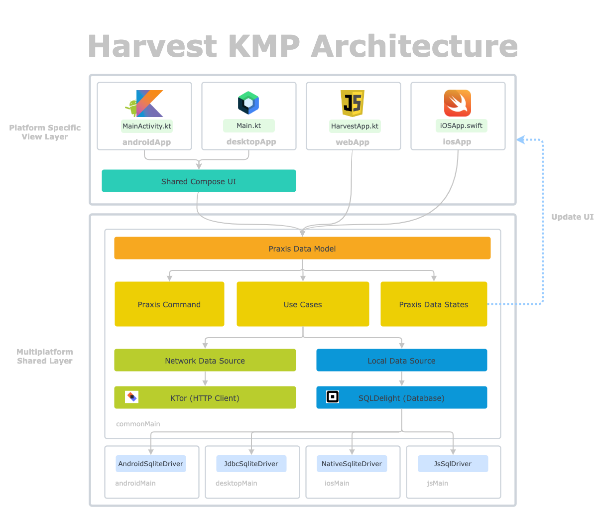
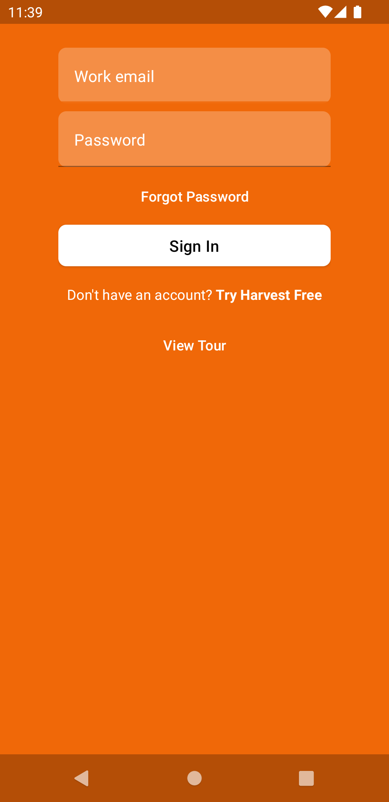

<div id="top"></div>

# 🕓 HarvestTime KMP
<p align="left"> Multi-Platform Harvest Time Tracking clone project built with SwiftUI, Jetpack Compose, Kotlin/Js </p>

[Access the Web App built with React + MUI here](https://harvestkmp.web.app)


<p align="left">
    <a href="https://kotlinlang.org/docs/releases.html">
      
    </a>
    <a href = "https://github.com/mutualmobile/HarvestTimeKMP/stargazers">
        
    </a>
    <a href = "https://github.com/mutualmobile/HarvestTimeKMP/network/members">
        
    </a>
    <a href = "https://github.com/mutualmobile/HarvestTimeKMP/issues">
        
    </a>
    <a href = "https://github.com/mutualmobile/HarvestTimeKMP/watchers">
        
    </a>
</p>
<p align="left">
    <a href="https://opensource.org/licenses/Apache-2.0">
      
    </a>
    <a href="">
        
    </a>
</p>

### The purpose of this repository:

- Build cross-platform applications and share common code between Android, iOS, Web and Desktop.
- Provide support for different platform with respective Native UI for each, and sharing the common business logic.
- Dependency Injection using Koin.
- Usage of latest Ktor client for Networking.
- Performing background task with Kotlin Coroutines.

### Currently running on:

- [x] <code></code> Android (Jetpack Compose)
- [x] <code></code> Web (Kotlin/JS + React + MUI)
- [x] <code></code> iOS (SwiftUI)
- [ ] <code></code> Desktop JVM (Jetpack Compose)
- [x] <code></code> MacOS (SwiftUI)

Built using [PraxisKMP](https://github.com/mutualmobile/PraxisKMP) as the base project.

<p align="right">[<a href="#top">Back to top</a>]</p>

<details>
  <summary>Table of content</summary>
  <ul>
    <li><a href="#%EF%B8%8F-architecture">Architecture</a></li>
    <li><a href="#-api">API</a></li>
    <li><a href="#%EF%B8%8F%EF%B8%8F-built-with-%EF%B8%8F-using-kotlin">Tech stack</a></li>
    <li><a href="#-screenshots">Screenshots</a></li>
    <li><a href="#-license">License</a></li>
  </ul>
</details>

## 🏛️ Architecture
<table style="width:100%">
  <tr>
    <td></td>
  </tr>
</table>

Architecture Diagram: [Here](https://drive.google.com/file/d/1aLgdk-3PUmAriNR_Z_mPNZBK-IrFpP1G/view?usp=sharing)

<p align="right">[<a href="#top">Back to top</a>]</p>

## 🌐 API
The Harvest API is written in Kotlin with SpringBoot. Find the repo [here](https://github.com/mutualmobile/HarvestAPISpring).

- Authentication :lock:
  - [x] Find Organization
  - [x] Sign In User
  - [x] Sign Up User
  - [x] Login User
  - [x] Forgot Password
  - [x] Change Password

- List Projects 📽
  - [x] Org admin can create projects
  - [x] Org admin can list,search projects
  - [x] Org admin can assign projects to users
  - [ ] more are.. 🚧 WIP

- Logging Time :office:
  - [ ] Log Time 🚧 WIP
  - [ ] an other

<p align="right">[<a href="#top">Back to top</a>]</p>

## 🏗️️ Built with ❤️ using Kotlin
| What            | How                        |
|----------------	|------------------------------	|
| 🎭 Android UI   | [Jetpack Compose](https://developer.android.com/jetpack/compose)                |
| 🎭 IOS UI   | [Swift UI](https://developer.apple.com/documentation/swiftui/)                |
| 🎭 Web UI   | [React JS with MUI](https://mui.com/)                |
| 🏗 Architecture    | [Clean](https://blog.cleancoder.com/uncle-bob/2012/08/13/the-clean-architecture.html)                            |
| 💉 DI                | [Koin](https://insert-koin.io/)                        |
| 🌊 Async            | [Coroutines, Flows, KMP Native Coroutines](https://github.com/rickclephas/KMP-NativeCoroutines)                |
| 🌐 Networking        | [Ktor](https://ktor.io/)                        |
| ð Storage       | [Key Value, SqlDelight](https://github.com/russhwolf/multiplatform-settings)                        |

<p align="right">[<a href="#top">Back to top</a>]</p>

## 📷 Screenshots
<ul>
<li><a href="#android-screenshots">Android</a></li>
<li><a href="#web-screenshots-reactjs">React</a></li>
<li><a href="#ios-screenshots">IOS</a></li>
<li><a href="#">Desktop 🚧 WIP</a></li>
<li><a href="#">MacOS 🚧 WIP</a></li>
</ul>

### Android Screenshots
- [OnBoarding](#android-onboarding-screens)
- [Authenticate](#android-authentication-screens)
- [Home](#android-home-screens)
- [Settings](#android-settings-screens)

<p align="right">[<a href="#top">Back to top</a>]</p>

#### Android OnBoarding Screens
<table style="width:100%">
  <tr>
    <th>OnBoarding One</th>
    <th>OnBoarding Two</th> 
    <th>OnBoarding Three</th>
    <th>OnBoarding Four</th> 
  </tr>
  <tr>
    <td></td> 
    <td></td>
    <td></td> 
    <td></td>
  </tr>
</table>

#### Android Authentication Screens
<table style="width:100%">
  <tr>
    <th>Enter Organization Screen</th>
    <th>Sign up Screen</th> 
    <th>Sign In Screen</th>
  </tr>
  <tr>
    <td></td> 
    <td></td>
    <td></td> 
  </tr>
</table>

#### Android Home Screens
<table style="width:100%">
  <tr>
    <th>Home Screen</th>
    <th>New Entry Screen</th> 
    <th>Home Drawer</th>
  </tr>
  <tr>
    <td></td> 
    <td></td>
    <td></td> 
  </tr>
</table>

#### Android Settings Screens
<table style="width:100%">
  <tr>
    <th>Settings Screen</th>
    <th>Report Screen</th> 
  </tr>
  <tr>
    <td></td> 
    <td></td>
  </tr>
</table>

<p align="right">[<a href="#top">Back to top</a>]</p>

### Web Screenshots (ReactJS)
- Authentication Screens
  - [Verify Organization Screen](#verify-organization-screen)
  - [Sign Up Screen](#sign-up-screen)
  - [Sign In Screen](#sign-in-screen)
  - [Log In Screen](#log-in-screen)
  - [Forgot Password Screen](#forgot-password-screen)
- Home Screens
  - [Home Screen](#home-screen)
  - [Home Drawer Screen](#home-drawer-screen)
  - [All User Screen](#all-user-screen)
  - [All Projects Screen](#all-project-assignment-screen)
  - [Settings Screen](#settings-screen)

#### Verify Organization Screen
<table style="width:100%">
  <tr>
    <th>Verify Organization</th>
  </tr>
  <tr>
    <td></td>
  </tr>
</table>

#### Sign Up Screen
<table style="width:100%">
  <tr>
    <th>Sign Up</th>
  </tr>
  <tr>
    <td></td>
  </tr>
</table>

#### Sign In Screen
<table style="width:100%">
  <tr>
    <th>Sign In</th>
  </tr>
  <tr>
    <td></td>
  </tr>
</table>

#### Log In Screen
<table style="width:100%">
  <tr>
    <th>Log In</th>
  </tr>
  <tr>
    <td></td>
  </tr>
</table>

#### Forgot Password Screen
<table style="width:100%">
  <tr>
    <th>Forgot Password</th>
  </tr>
  <tr>
    <td></td>
  </tr>
</table>

#### Home Screen
<table style="width:100%">
  <tr>
    <th>Home</th>
  </tr>
  <tr>
    <td></td>
  </tr>
</table>

#### Home Drawer Screen
<table style="width:100%">
  <tr>
    <th>Home Drawer</th>
  </tr>
  <tr>
    <td></td>
  </tr>
</table>

#### All User Screen
<table style="width:100%">
  <tr>
    <th>All User</th>
  </tr>
  <tr>
    <td></td>
  </tr>
</table>

#### All Project Assignment Screen
<table style="width:100%">
  <tr>
    <th>All Project Assignment</th>
  </tr>
  <tr>
    <td></td>
  </tr>
</table>

#### Settings Screen
<table style="width:100%">
  <tr>
    <th>Settings</th>
  </tr>
  <tr>
    <td></td>
  </tr>
</table>

<p align="right">[<a href="#top">Back to top</a>]</p>

### iOS Screenshots
- [Authentications](#ios-authentications-screen)

#### iOS Authentications Screen

<table style="width:100%">
  <tr>
    <th>On Boarding Screen</th>
    <th>Sign In Screen</th> 
  </tr>
  <tr>
    <td></td> 
    <td></td>
  </tr>
</table>

<p align="right">[<a href="#top">Back to top</a>]</p>

### 🪪 License
```
Copyright 2022 Mutual Mobile

Licensed under the Apache License, Version 2.0 (the "License");
you may not use this file except in compliance with the License.
You may obtain a copy of the License at

http://www.apache.org/licenses/LICENSE-2.0

Unless required by applicable law or agreed to in writing, software
distributed under the License is distributed on an "AS IS" BASIS,
WITHOUT WARRANTIES OR CONDITIONS OF ANY KIND, either express or implied.
See the License for the specific language governing permissions and
limitations under the License.
  ```
