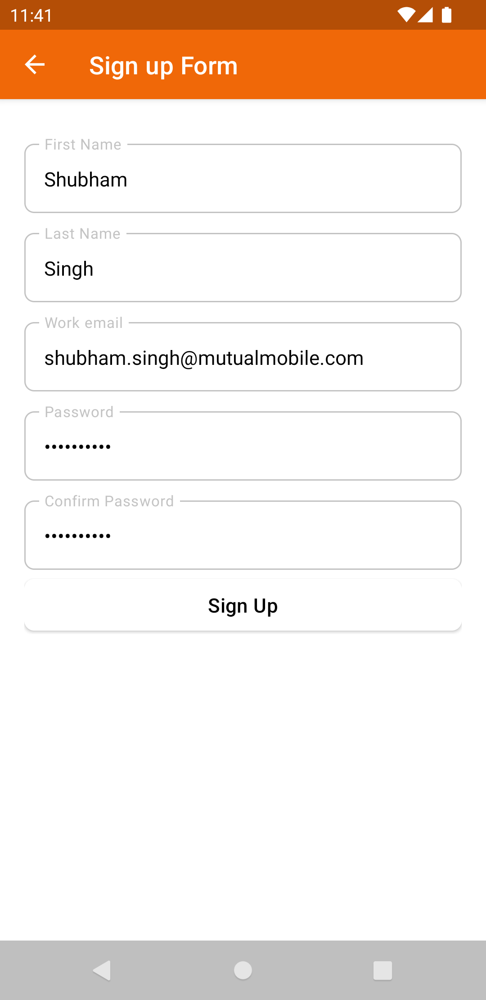

# HarvestTime KMP
--------------------
Multi-Platform Harvest Time Tracking clone project built with SwiftUI, Jetpack Compose, Kotlin/Js 

Currently running on

* Android (Jetpack Compose) 🚧 WIP
* Web (Kotlin/JS + React + MUI) 🚧 WIP
* iOS (SwiftUI) 🚧 WIP
* Desktop JVM (Jetpack Compose) 🚧 WIP
* macOS (SwiftUI) 🚧 WIP

Built using [PraxisKMP](https://github.com/mutualmobile/PraxisKMP) as the base project.

### API
-----------
The Harvest API written in Kotlin with SpringBoot. Find the repo [here](https://github.com/mutualmobile/HarvestAPISpring).

- Authentication :lock:
    - Find Organization ✅ DONE
    - Sign In User ✅ DONE
    - Sign Up User ✅ DONE
    - Login User ✅ DONE
    - Forgot Password ✅ DONE
    - Change Password ✅ DONE

- Organization :office:
    - Assign Projects ✅ DONE
    - Log Time ✅ DONE
    - more are.. 🚧 WIP

## 🏗️️ Built with ❤️ using Kotlin
--------------------------------------

| What            | How                        |
|----------------	|------------------------------	|
| 🎭 Android UI   | [Jetpack Compose](https://developer.android.com/jetpack/compose)                |
| 🎭 IOS UI   | [Swift UI](https://developer.apple.com/documentation/swiftui/)                |
| 🎭 Web UI   | [React JS with MUI](https://mui.com/)                |
| 🏗 Architecture    | [Clean](https://blog.cleancoder.com/uncle-bob/2012/08/13/the-clean-architecture.html)                            |
| 💉 DI                | [Koin](https://insert-koin.io/)                        |
| 🌊 Async            | [Coroutines, Flows, KMP Native Coroutines](https://github.com/rickclephas/KMP-NativeCoroutines)                |
| 🌐 Networking        | [Ktor](https://ktor.io/)                        |
| ð Storage       | [Key Value, SqlDelight](https://github.com/russhwolf/multiplatform-settings)                        |

## Aim :
------------------

- To provide support for different platform with respective Native UI for each, and sharing the
  common business logic.
- Dependency Injection using Koin
- Usage of latest Ktor client for Networking.
- Performing background task with Kotlin Coroutines.

### Screenshots
-------------------------

- [Android](#-android-screenshots)
- [React](#web-screenshots-reactjs)
- [IOS](#ios-authentications-screen)
- Desktop  🚧 WIP
- MacOS  🚧 WIP

### Android Screenshots
---------------------

- [OnBoarding](#android-onboarding-screens)
- [Authenticate](#android-authentication-screens)
- [Home](#android-home-screens)
- [Settings](#android-settings-screens)

#### Android OnBoarding Screens

<table style="width:100%">
  <tr>
    <th>1.OnBoarding One</th>
    <th>2.OnBoarding Two</th> 
    <th>3.OnBoarding Three</th>
    <th>4.OnBoarding Four</th> 
  </tr>
  <tr>
    <td></td> 
    <td></td>
    <td></td> 
    <td></td>
  </tr>
</table>

#### Android Authentication Screens

<table style="width:100%">
  <tr>
    <th>1.Enter Organization Screen</th>
    <th>2.Sign up Screen</th> 
    <th>3.Sign In Screen</th>
  </tr>
  <tr>
    <td></td> 
    <td></td>
    <td></td> 
  </tr>
</table>

#### Android Home Screens

<table style="width:100%">
  <tr>
    <th>1.Home Screen</th>
    <th>2.New Entry Screen</th> 
     <th>3.Home Drawer</th>
  </tr>
  <tr>
    <td></td> 
    <td></td>
    <td></td> 
  </tr>
</table>

#### Android Settings Screens

<table style="width:100%">
  <tr>
    <th>1.Settings Screens</th>
    <th>2.Report Screen</th> 
  </tr>
  <tr>
    <td></td> 
    <td></td>
  </tr>
</table>

### Web Screenshots (ReactJS)
- Authentication Screens
  - [Verify Organization Screen](#verify-organization-screen)
  - [Sign Up Screen](#sign-up-screen)
  - [Sign In Screen](#sign-in-screen) 
  - [Log In Screen](#log-in-screen) 
  - [Forgot Password Screen](#forgot-password-screen) 
- Home Screens
  - [Home Screen](#home-screen) 
  - [Home Drawer Screen](#home-drawer-screen) 
  - [All User Screen](#all-user-screen) 
  - [All Projects Screen](#all-project-screen)
  - [Settings Screen](#settings-screen)

#### Verify Organization Screen

#### Sign Up Screen

#### Sign In Screen

#### Log In Screen

#### Forgot Password Screen

#### Home Screen

#### Home Drawer Screen

#### All User Screen

#### All Project Assignment Screen

#### Settings Screen

### iOS Screenshots

- [Authentications](#ios-authentications-screen)

#### iOS Authentications Screen

<table style="width:100%">
  <tr>
    <th>1.onBoarding Screen</th>
    <th>2.Sign In Screen</th> 
  </tr>
  <tr>
    <td></td> 
    <td></td>
  </tr>
</table>

License
=======
    Copyright 2022 Mutual Mobile

    Licensed under the Apache License, Version 2.0 (the "License");
    you may not use this file except in compliance with the License.
    You may obtain a copy of the License at

       http://www.apache.org/licenses/LICENSE-2.0

    Unless required by applicable law or agreed to in writing, software
    distributed under the License is distributed on an "AS IS" BASIS,
    WITHOUT WARRANTIES OR CONDITIONS OF ANY KIND, either express or implied.
    See the License for the specific language governing permissions and
    limitations under the License.
